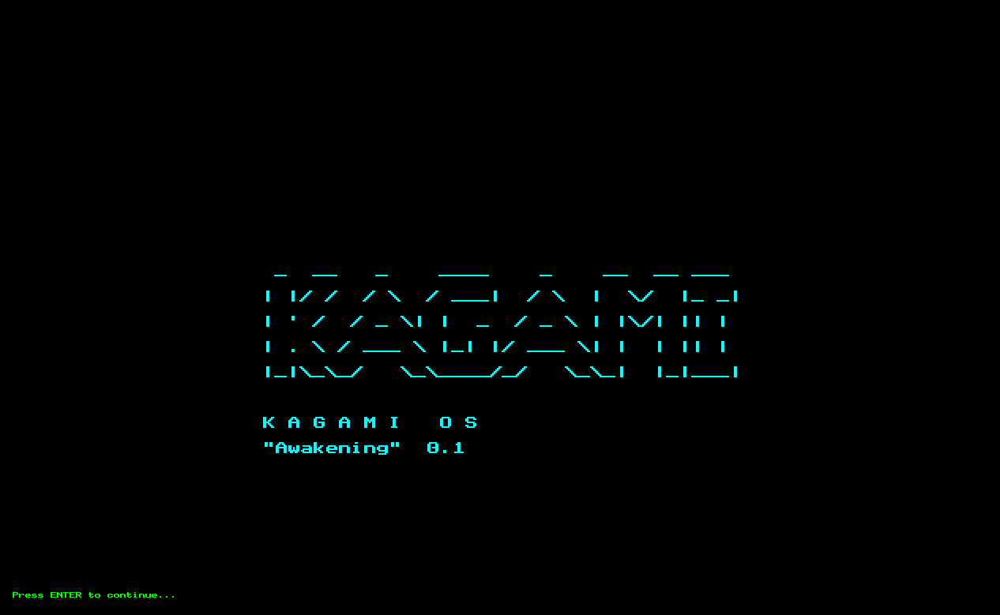

# Kagami OS 鏡 — "Awakening" 0.1



*In a realm where silicon dreams meet assembly nightmares, a lone kernel awakens from the void...*

A mystical operating system forged in the fires of x86 assembly, where dragons (bugs) lurk in every memory address and heroes (developers) battle segmentation faults with nothing but determination and excessive amounts of caffeine.

Legend speaks of an ancient bootloader, carved from the primordial bits themselves, capable of summoning a kernel from the depths of 0x100000. They say those who successfully boot this OS gain forbidden knowledge of hardware secrets and the ability to speak directly to the machine spirits.

**Current Quest:** Press ENTER to awaken the system. Witness the cyan prophecy. Enter the shell of legends.

---

## 🚀 Quick Start (Summon the OS)

**UEFI Mode (Recommended for mortals):**
```bash
make run
```


---

## 🎮 Shell Commands (Your Spellbook)

Once you awaken the OS, these are your incantations:

**📚 [Complete Command Reference → COMMANDS.md](COMMANDS.md)**

The OS now features **18 powerful commands** for file management, navigation, and system control!

**Quick Command List:**
- **System:** `help`, `logo`, `status`, `whoami`
- **Navigation:** `pwd`, `ls`, `tree`, `cd`
- **File Operations:** `read`, `create`, `write`, `copy`, `find`, `rm`
- **Utility:** `echo`, `clear`
- **User Management:** `useradd`, `login`

💡 **Tip:** All commands support `-h` or `--help` for detailed usage information!

**Example Spells:**
```bash
help              # Show all commands
pwd               # Where am I?
ls                # What's here?
create file.txt   # Summon a scroll
write file.txt Hello from Kagami!
read file.txt     # Read the scroll
tree              # View the realm structure
find readme       # Seek hidden scrolls
```

---

## ✨ Features (What Powers You Possess)

- 🎨 **Mystical Graphics** - Direct GPU framebuffer manipulation (1280×800)
- ⌨️ **Keyboard Sorcery** - PS/2 controller communion with full scancode support
- 🖥️ **Interactive Shell** - 18 powerful commands to control the realm
- 📁 **File System** - Virtual in-memory file system with Linux-style `/home` structure
- 💾 **Memory Magic** - Heap allocation spells
- 🛡️ **Exception Shields** - Interrupt handlers stand guard
- 📜 **ASCII Prophecy** - Beautiful boot logo in mystical colors
- 👥 **User Management** - Multi-user support with home directories
- 🔍 **Auto-Scrolling** - History preserved as you journey through commands

📖 **[Full Documentation → COMMANDS.md](COMMANDS.md)** - Complete command reference with examples

---

## 📋 To-Do List (Future Enchantments)

- [ ] GUI System (Windows of power)
- [ ] File System (Scroll storage)
- [ ] Network Stack (Ethereal communication)
- [ ] More shell commands (Expand the spellbook)
- [ ] Mouse support (Pointing magic)
- [ ] Audio driver (Sonic sorcery)

---

## 📄 License

**The "Do Whatever" License** ✨

You can:
- ✅ Use it to learn
- ✅ Modify it into oblivion
- ✅ Share it with your friends
- ✅ Summon demons (not recommended)
- ✅ Claim you wrote it from scratch (we'll know, but go ahead)
- ❌ Sue me when your computer spontaneously combusts

**Fine print written in ancient runes:**  
*"By pressing the power button, you acknowledge that the spirits of crashed kernels past may haunt your boot sector. The author cannot be held responsible for triple faults, segmentation violations, or existential crises resulting from bare-metal programming."*

---

## 👤 Author

**Conjured from the keyboard by:** A caffeinated wizard who spent too much time reading Intel manuals and not enough time touching grass.

**Spirit Animal:** A CPU stuck in an infinite loop

**Favorite Memory Address:** 0xDEADBEEF (RIP)

**Life Motto:** "It compiles? Ship it. It boots? It's perfect. It crashes? That's a feature."

**Achievement Unlocked:** ⭐ Made a computer say "Hello" without using an OS (then made an OS to say it anyway)

---

## 🌟 Final Words

*"In the beginning, there was darkness. Then someone wrote `mov ax, 0x07C0` and there was light (and many segfaults)."*

May your stack never overflow, your pointers always be aligned, and your interrupts forever be handled gracefully.

**Go forth and boot!** 🚀✨

---

*P.S. - If it doesn't work, try turning it off and on again. If it still doesn't work, check if QEMU is installed. If it STILL doesn't work, blame cosmic rays.*
